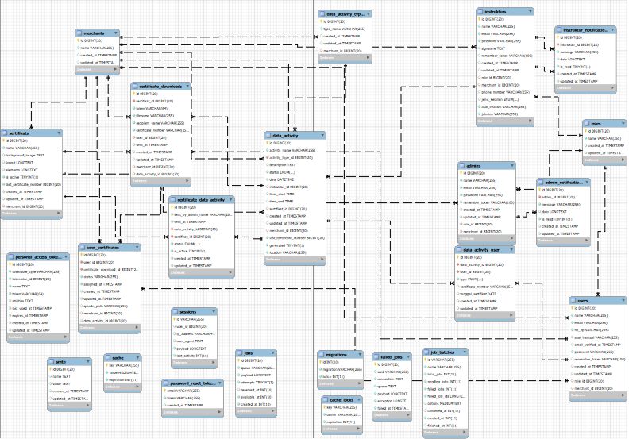
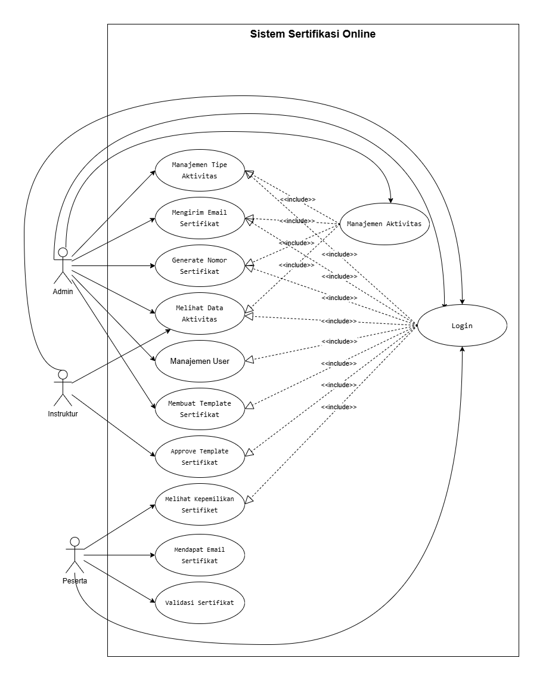

# Pengenalan Proyek Sertifikasi Online Diantara - Backend

## 📋 Daftar Isi

1. [Tujuan Web](#tujuan-web)
2. [Fitur Utama](#fitur-utama)
3. [Akun Default](#akun-default)
4. [Diagram ERD](#diagram-erd)
5. [Diagram UML](#diagram-uml)
6. [Relasi Tabel](#relasi-tabel)
7. [Prasyarat](#prasyarat)
8. [Instalasi dari Git](#instalasi-dari-git)
9. [Konfigurasi Database](#konfigurasi-database)
10. [Migrasi dan Symlink](#migrasi-dan-symlink)
11. [Menjalankan Aplikasi](#menjalankan-aplikasi)

---

## 🎯 Tujuan Web

Aplikasi **Sertifikasi Online Diantara** adalah platform berbasis web yang dirancang untuk:

1. **Mengelola Sertifikasi Online** - Memfasilitasi pembuatan, distribusi, dan verifikasi sertifikat digital secara online
2. **Meningkatkan Aksesibilitas** - Memberikan akses mudah bagi peserta untuk mendapatkan sertifikat mereka
3. **Automasi Proses** - Mengotomatiskan alur kerja sertifikasi dari pendaftaran hingga pengiriman sertifikat
4. **Keamanan Data** - Menjaga integritas dan keamanan data peserta dan instruktur
5. **Laporan dan Analytics** - Menyediakan dashboard dan laporan untuk analisis data sertifikasi

---

## ✨ Fitur Utama

### Fitur untuk Peserta:

- ✅ Melihat daftar sertifikat yang diperoleh
- ✅ Download sertifikat digital
- ✅ Validasi/Verifikasi sertifikat menggunakan QR Code
- ✅ Riwayat aktivitas kegiatan

### Fitur untuk Instruktur:

- ✅ Melihat data kegiatan/aktivitas
- ✅ Generate sertifikat untuk peserta
- ✅ Manajemen notifikasi

### Fitur untuk Admin:

- ✅ Manajemen pengguna (peserta, instruktur, admin)
- ✅ Manajemen roles dan permissions
- ✅ Manajemen merchant/organisasi
- ✅ Dashboard analytics
- ✅ Manajemen notifikasi
- ✅ Export/Import data

### Fitur Teknis:

- ✅ Sistem autentikasi dengan Sanctum
- ✅ Generate QR Code untuk verifikasi sertifikat
- ✅ Generate PDF sertifikat dengan Dompdf
- ✅ Manajemen file dengan Storage
- ✅ API RESTful untuk integrasi
- ✅ Task scheduling untuk automasi
- ✅ Email notification system

---

## 🔐 Akun Default

Setelah instalasi dan menjalankan seeder, akun default berikut tersedia:

### Admin Account:

```
Email    : dev@diantara.net
Password : programmer
Role     : Admin
```

### Instruktur Account:

```
Email    : instruktur@example.com
Password : password
Nama     : John Doe
Role     : Instruktur
```

### Peserta Account:

```
Email    : test@example.com
Password : password
Nama     : Test User
No. HP   : 081234567890
Role     : Peserta
```

**Catatan**: Ubah password ini setelah login pertama kali untuk keamanan.

---

## 📊 Diagram ERD

### Entity Relationship Diagram



**Deskripsi**: Diagram di atas menunjukkan hubungan antara semua tabel dalam sistem Sertifikasi Online Diantara. Setiap entitas memiliki atribut dan relasi yang jelas untuk mendukung fungsionalitas sistem.

---

## 📐 Diagram UML

### Use Case Diagram



**Deskripsi**: Diagram Use Case menunjukkan interaksi antara aktor (Peserta, Instruktur, Admin) dan use case yang tersedia dalam sistem. Setiap aktor dapat melakukan aksi-aksi tertentu sesuai dengan peran mereka.

---

## 🔧 Prasyarat

Sebelum memulai instalasi, pastikan sistem Anda memiliki:

### Software yang Diperlukan:

1. **PHP** ≥ 8.2

   - Download: https://www.php.net/downloads
   - Verify: `php --version`

2. **Composer** (PHP Package Manager)

   - Download: https://getcomposer.org/download/
   - Verify: `composer --version`

3. **Node.js & npm** (untuk Vite/Frontend Assets)

   - Download: https://nodejs.org/
   - Verify: `node --version` dan `npm --version`

4. **Git**

   - Download: https://git-scm.com/download/win
   - Verify: `git --version`

5. **MySQL/MariaDB** ≥ 5.7

   - Download: https://www.mysql.com/downloads/
   - Verify: `mysql --version`

6. **PHP Imagick Extension**
   - Download: https://mlocati.github.io/articles/php-windows-imagick.html
   - Extension untuk manipulasi gambar dan certificate generation

### Sistem Operasi:

- ✅ Windows 10/11
- ✅ macOS 10.13+
- ✅ Linux (Ubuntu/Debian/CentOS)

### Hardware Minimum:

- RAM: 2GB
- Storage: 500MB
- Processor: Dual-core 2GHz

---

## 📥 Instalasi dari Git

### Step 1: Clone Repository

```bash
# Buka terminal/PowerShell
# Navigasi ke folder yang diinginkan
cd C:\Projects

# Clone repository
git clone https://github.com/davyaugustnurismail/ukk_git.git

# Masuk ke folder project
cd sertifikasi-online-diantara-backend
```

### Step 2: Install Dependencies

```bash
# Install PHP dependencies menggunakan Composer
composer install

# Install JavaScript dependencies menggunakan npm
npm install
```

### Step 3: Copy dan Setup Environment File

```bash
# Copy .env.example ke .env
cp .env.example .env

# Atau di Windows (PowerShell):
Copy-Item .env.example .env
```

---

## 🗄️ Konfigurasi Database

### Step 1: Buat Database di MySQL

Buka MySQL command line atau GUI tool (phpMyAdmin) dan buat database:

```sql
CREATE DATABASE sertifikasi_online CHARACTER SET utf8mb4 COLLATE utf8mb4_unicode_ci;
```

### Step 2: Edit File .env

Buka file `.env` dan atur konfigurasi database MySQL:

```env
DB_CONNECTION=mysql
DB_HOST=127.0.0.1
DB_PORT=3306
DB_DATABASE=sertifikasi_online
DB_USERNAME=root
DB_PASSWORD=your_password
```

Sesuaikan `DB_USERNAME` dan `DB_PASSWORD` dengan konfigurasi MySQL Anda.

### Step 3: Konfigurasi Lainnya

Di file `.env`, pastikan juga mengatur:

```env
# App Config
APP_NAME=SOD
APP_ENV=local
APP_DEBUG=true
APP_URL=http://localhost:8000
FRONTEND_URL=http://localhost:3000

# Sanctum (API Authentication)
SANCTUM_STATEFUL_DOMAINS=localhost

# Mail Configuration (Optional)
MAIL_MAILER=smtp
MAIL_HOST=smtp.gmail.com
MAIL_PORT=587
MAIL_USERNAME=your_email@gmail.com
MAIL_PASSWORD=your_app_password
MAIL_ENCRYPTION=tls
MAIL_FROM_ADDRESS=noreply@example.com
MAIL_FROM_NAME="Sertifikasi Online Diantara"
```

### Step 4: Generate Application Key

```bash
php artisan key:generate
```

---

## 🔄 Migrasi dan Symlink

### Step 1: Jalankan Database Migrations

Migrasi akan membuat semua tabel yang diperlukan di database:

```bash
# Jalankan semua migration
php artisan migrate

# Jika ingin rollback (membatalkan)
php artisan migrate:rollback

# Jika ingin fresh (reset dan migrate ulang)
php artisan migrate:fresh
```

### Step 2: Seed Database (Opsional)

Isi database dengan data awal termasuk akun admin:

```bash
# Jalankan semua seeder
php artisan db:seed

# Atau jalankan seeder tertentu
php artisan db:seed --class=AdminSeeder

# Jika ingin fresh dengan seed
php artisan migrate:fresh --seed
```

### Step 3: Buat Symlink untuk Storage

Symlink diperlukan agar file yang disimpan di storage dapat diakses via HTTP:

```bash
# Buat symlink dari storage/app/public ke public/storage
php artisan storage:link

# Untuk Windows (jika command di atas tidak berhasil):
# Gunakan mklink dengan Command Prompt (Admin):
mklink /D "C:\path\to\project\public\storage" "C:\path\to\project\storage\app\public"
```

**Verifikasi**: Buka folder `public/storage` - seharusnya ada symlink ke `storage/app/public`

---

## 🚀 Menjalankan Aplikasi

### Terminal 1: Jalankan Backend Server

```bash
# Jalankan Laravel server pada port 8000 (default)
php artisan serve

# Output:
# INFO  Server running on [http://127.0.0.1:8000].
```

### Terminal 2: Jalankan Vite Development Server (untuk Assets Frontend)

```bash
# Jalankan dari folder frontend (sertifikasi-online-diantara)
# Navigasi ke folder frontend
cd ../sertifikasi-online-diantara

# Jalankan Vite dev server pada port 3000 (default)
npm run dev

# Output:
# VITE v7.0.0  ready in 123 ms
# ➜  Local:   http://localhost:3000/
```

Aplikasi sekarang dapat diakses di:

- **Backend API**: http://localhost:8000
- **Frontend**: http://localhost:3000

---

## 👥 Tim Pengembang

Proyek ini dikembangkan oleh Tim Sertifikasi Online Diantara.

---

**Terakhir diupdate**: November 2025
**Versi Laravel**: 12.0
**Versi PHP**: 8.2+
**Database**: MySQL
